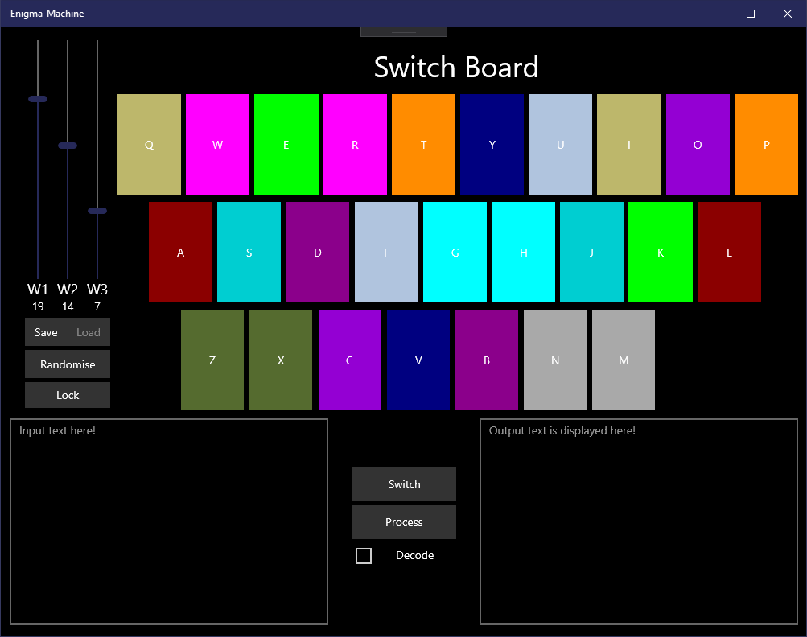

# Enigma-Machine
This is a rework of an old project written with C# and using windows forms.\
It is based on C# and UWP platform, and was a project intended to introduce me to the basics of UWP.

## How to use

### Wheels
The original enigma machine used a **series of wheels** to encode and decode text, in this program these are represented by the 3 sliders labelled W1, W2, and W3.\
These can be set by dragging the sliders up and down.

### Encoding text
Text can be encoded by entering text into the input box, ensuring the "Decode" checkbox is unticked, and clicking the process button. The updated text will be displayed in the output text box.

### Decoding text
Text can be decoded by checking the *"Decode"*checkbox, and clicking process. Any text in the input box will be processed via the reverse of the encoding, resulting in the original text being revealed. In order for this to work, the wheels and switch board MUST be the same, or the process will not work.

The *"Switch"* button will help here, as you can use it to switch the encoded text back into the input box before decoding.

### Saving and loading settings
Settings can be loaded and saved using the *"Load"* and *"Save"* buttons. This is useful when encoding and then decoding text, as you can save your original settings for the decoding stage instead of remembering them.
